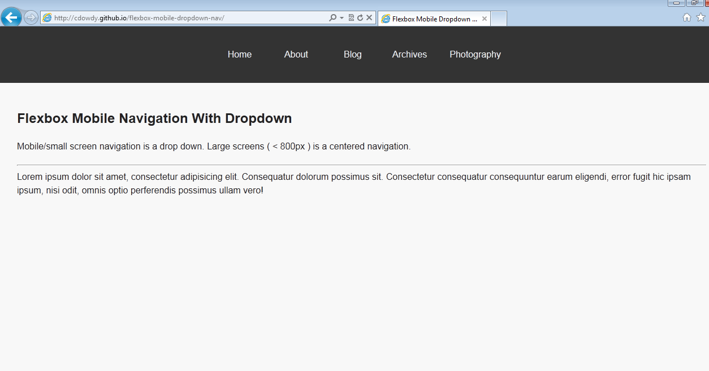

# flexbox-mobile-dropdown-nav

Mobile and Small Screen Flexbox based dropdown navigation.  

Drop Down Mobile navigation up to 800 px wide device. Then its a centered navigation:

Support to Internet Explorer 9 ( maybe 8 haven't tested - see image below for ie9 )  

* removed the sticky footer  
* updated to support IE 9.  
* Demo page has no contrast warnings from Webaim.org
* JS has a11y attributes from [a11y Project](http://a11yproject.com/)

# Demo
[Flexbox Dropdown Navigation Demo](https://cdowdy.github.io/flexbox-mobile-dropdown-nav)
